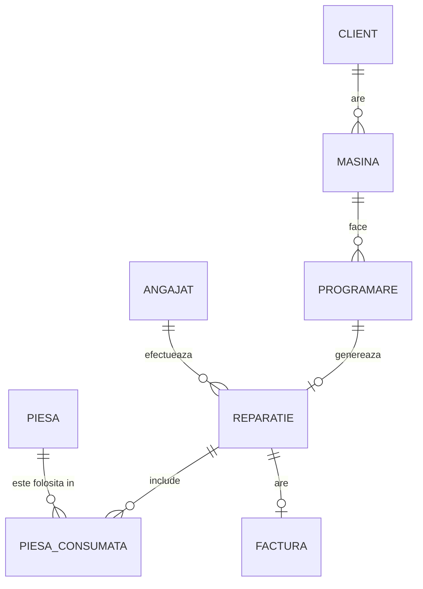

# Diagrama ER - Model Conceptual Service Auto

```mermaid
erDiagram
    CLIENT ||--o{ MASINA : "are"
    MASINA ||--o{ PROGRAMARE : "face"
    PROGRAMARE ||--o| REPARATIE : "genereaza"
    ANGAJAT ||--o{ REPARATIE : "efectueaza"
    REPARATIE ||--o{ PIESA_CONSUMATA : "include"
    PIESA ||--o{ PIESA_CONSUMATA : "este folosita in"
    REPARATIE ||--o| FACTURA : "are"
```
